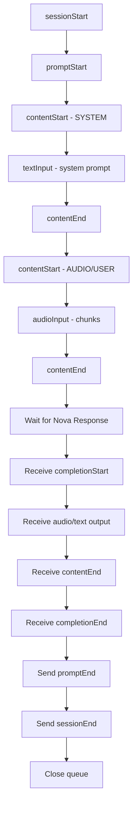

# @gravityai-dev/aws-nova

[](https://www.npmjs.com/package/@gravityai-dev/aws-nova)
[](https://opensource.org/licenses/MIT)

> **Multimodal speech generation with AWS Nova Sonic** - Support for both text-to-speech and speech-to-speech with real-time streaming.

## Features

- 🎤 **Speech-to-Speech** - Process audio input and generate speech responses
- 🔤 **Text-to-Speech** - Convert text to natural-sounding speech
- 🌊 **Real-time Streaming** - Stream audio chunks as they're generated
- 🔧 **Tool Integration** - Support for function calling and RAG tools
- 🎭 **Multiple Voices** - 11 different voices with accent support
- 📊 **Usage Analytics** - Token counting and performance metrics
- 🔄 **Redis Integration** - Real-time audio publishing to Redis streams
- 🔇 **Audio Feedback Prevention** - Automatic microphone muting during playback
- 🛡️ **Error Recovery** - Automatic cleanup events for robust session management
- 🎵 **Smooth Playback** - Server and client-side audio buffering

## Quick Start

### Installation

```bash
npm install @gravityai-dev/aws-nova
```

### Basic Usage

```typescript
import { NovaSpeechService } from '@gravityai-dev/aws-nova';

const service = new NovaSpeechService();

// Text-to-speech
const result = await service.generateSpeechStream({
  systemPrompt: "You are a helpful assistant.",
  voice: "tiffany",
  temperature: 0.7,
  redisChannel: "audio-stream"
}, metadata, context);

console.log(`Generated ${result.chunk_count} audio chunks`);
```

### Speech-to-Speech

```typescript
// Process audio input (Base64 encoded PCM)
const result = await service.generateSpeechStream({
  audioInput: base64AudioData, // 16kHz, 16-bit, mono PCM
  systemPrompt: "Respond conversationally",
  voice: "matthew"
}, metadata, context);

console.log("Transcription:", result.transcription);
console.log("Response:", result.assistantResponse);
```

## Available Voices

Choose from 11 different voices with regional accents:

| Voice | Gender | Accent | Description |
|-------|--------|--------|-------------|
| `tiffany` | Female | American | Default, clear and professional |
| `matthew` | Male | American | Warm and conversational |
| `amy` | Female | American | Friendly and approachable |
| `ambre` | Female | French | Elegant French accent |
| `florian` | Male | German | Professional German accent |
| `beatrice` | Female | Italian | Melodic Italian accent |
| `lorenzo` | Male | Italian | Rich Italian accent |
| `greta` | Female | Swedish | Clear Swedish accent |
| `lennart` | Male | Swedish | Distinctive Swedish accent |
| `lupe` | Female | Spanish | Vibrant Spanish accent |
| `carlos` | Male | Spanish | Confident Spanish accent |

## Configuration Options

```typescript
interface NovaSpeechConfig {
  systemPrompt?: string;     // System instructions
  audioInput?: string;       // Base64 PCM audio (16kHz, 16-bit, mono)
  voice?: string;           // Voice selection (default: "tiffany")
  temperature?: number;     // Generation creativity (0-1)
  topP?: number;           // Nucleus sampling (0-1)
  redisChannel?: string;   // Redis channel for audio streaming
  conversationHistory?: Array<{role: string, content: string}>;
  toolResponse?: any[];    // Tool/RAG responses
  controlSignal?: string;  // "START_CALL" | "STOP"
}
```

## Real-time Audio Streaming

Audio is streamed in real-time via Redis:

```typescript
// Subscribe to audio stream
const redis = new Redis();
redis.subscribe('audio-stream-channel');

redis.on('message', (channel, message) => {
  const audioChunk = JSON.parse(message);
  // audioChunk.audioData contains Base64 MP3 data
  playAudioChunk(audioChunk.audioData);
});
```

## Tool Integration

Support for function calling and RAG tools:

```typescript
const result = await service.generateSpeechStream({
  systemPrompt: "You can search for information when needed.",
  toolResponse: [
    { title: "Weather", content: "Sunny, 75°F" }
  ]
}, metadata, context);
```

## Architecture

Clean, modular architecture with focused components:

```
├── index.ts                    # Clean entry point (47 lines)
├── orchestration/
│   └── SessionOrchestrator.ts  # Main business logic
├── client/
│   └── BedrockClientFactory.ts # AWS client creation
├── audio/
│   └── AudioBufferManager.ts   # Audio buffering & Redis
├── processing/
│   ├── EventParser.ts          # Event parsing & validation
│   ├── TextAccumulator.ts      # Transcription separation
│   └── UsageStatsCollector.ts  # Metrics collection
├── errors/
│   └── AwsErrorHandler.ts      # Centralized error handling
└── stream/                     # Core streaming components
```

## Requirements

- Node.js 16+
- AWS credentials with Bedrock access
- Redis server (for audio streaming)

## Error Handling

The package includes comprehensive error handling:

- **ValidationException** - Invalid event sequences
- **ModelStreamErrorException** - Nova model errors  
- **Timeout Protection** - Automatic recovery from timeouts
- **Centralized Logging** - Detailed error reporting
- **Session Recovery** - Automatic cleanup events (contentEnd, promptEnd, sessionEnd) on errors
- **Startup Cleanup** - Sends cleanup sequence on START_CALL to ensure clean state

## Advanced Usage

### Conversation History

```typescript
const result = await service.generateSpeechStream({
  conversationHistory: [
    { role: "user", content: "Hello" },
    { role: "assistant", content: "Hi there!" }
  ],
  systemPrompt: "Continue the conversation naturally"
}, metadata, context);
```

### Audio Format Requirements

**Input Audio:**
- Format: Raw PCM (not WAV)
- Sample Rate: 16kHz
- Bit Depth: 16-bit signed little-endian
- Channels: Mono
- Encoding: Base64

**Output Audio:**
- Format: MP3
- Encoding: Base64
- Streaming: Real-time chunks via Redis

## Response Format

```typescript
interface NovaSpeechStats {
  estimated: boolean;
  total_tokens: number;
  inputTokens: number;
  outputTokens: number;
  chunk_count: number;
  textOutput: string;          // Full text response
  transcription: string;       // User's speech transcription
  assistantResponse: string;   // Assistant's text response
  audioOutput?: string;        // Base64 MP3 audio
}
```

## Recent Improvements

### Audio Feedback Prevention
- Microphone automatically mutes when Nova starts speaking
- Prevents echo loops where Nova hears its own output
- DirectStreamingAudioPlayer notifies immediately on first audio chunk

### Session State Management  
- Sends full cleanup sequence on START_CALL to ensure clean state
- Prevents Nova from getting stuck in bad state from previous errors
- Follows AWS best practices for error recovery

### Audio Streaming Reliability
- Server buffers small 2.5KB chunks into 10KB chunks
- Client waits for 3+ chunks before processing
- Results in smoother playback without gaps

### Publishing Pattern
- Uses platform's gravityPublish function consistently
- Fire-and-forget pattern with error logging
- Avoids hanging on Redis operations

## Contributing

1. Fork the repository
2. Create a feature branch
3. Make your changes
4. Add tests
5. Submit a pull request

## License

MIT License - see LICENSE file for details.

---

## Implementation Notes

### Critical Event Sequence

⚠️ **promptEnd MUST be sent AFTER Nova's completionEnd response**

```
1. Send input events (sessionStart → promptStart → content)
2. Wait for Nova response  
3. Receive: completionStart → audioOutput → contentEnd → completionEnd
4. On completionEnd: Send promptEnd → sessionEnd → close queue
5. On timeout error: Trigger same completion handler
```

### Token Count Understanding

**Speech Tokens vs Text Tokens:**
- **Text Tokens**: ~4 chars/token, standard NLP tokenization
- **Speech Tokens**: ~150 tokens/second, time-based audio segmentation
- System prompt (364 chars) = 22 text tokens is normal
- Audio input (1s @ 16kHz) = ~150 speech tokens is expected

### Audio Format Requirements

**Input Audio (from Polly to Nova):**
- Format: Raw PCM (NOT WAV)
- Sample Rate: 16kHz
- Bit Depth: 16-bit signed little-endian
- Channels: Mono
- Encoding: Base64
- Chunking: 24KB chunks work well

## AWS Nova Speech Service

This service provides integration with AWS Nova Speech (Sonic) for text-to-speech and speech-to-speech capabilities.

## Important Implementation Notes

### Handling Nova Speech Completion Events

Nova Speech has been observed to be unreliable in sending `completionEnd` events. To ensure proper session closure and event handling, the implementation uses the following approach:

1. **ContentEnd with END_TURN**: When a `contentEnd` event is received with `stopReason: "END_TURN"`, the system automatically synthesizes a `completionEnd` event and triggers the completion handler.

2. **Timeout Handling**: When Nova times out waiting for input events (ValidationException), the system:
   - Creates a synthetic `contentEnd` event with `stopReason: "END_TURN"`
   - Processes it through the response processor
   - This automatically triggers the completion flow

This approach ensures reliable session closure regardless of whether Nova sends a `completionEnd` event or not.

### ⚠️ IMPORTANT: Nova Sonic Audio-Only Mode ⚠️

**Nova Sonic does NOT require or accept user text prompts when processing audio input.**

When using audio input:

- ✅ Send: sessionStart → promptStart → systemPrompt → audioInput → (wait for response)
- ❌ Do NOT send: user text events
- The audio itself IS the user input - no text transcription needed
- Nova will process the audio directly without requiring a text representation

## 🔧 Tool Use with Nova Speech

### Overview

Nova Speech supports tool use (function calling) for enhanced capabilities. Tools must be configured in the `promptStart` event and Nova will automatically request tools when needed.

### Tool Configuration

Tools are configured in the `promptStart` event:

```typescript
{
  event: {
    promptStart: {
      promptName: "chat_123",
      toolConfiguration: {
        tools: [{
          toolSpec: {
            name: "RAGtool",
            description: "Retrieves relevant information from a knowledge base",
            inputSchema: {
              json: '{"type":"object","properties":{"query":{"type":"string"}},"required":["query"]}'
            }
          }
        }],
        toolChoice: {
          tool: { name: "RAGtool" } // Optional: force tool use
        }
      }
    }
  }
}
```

### Tool Response Format

Nova expects tool results in a specific format according to AWS documentation:

```typescript
{
  event: {
    toolResult: {
      promptName: "chat_123",
      contentName: "unique-content-id",
      content: '[{"json": <your-tool-result>}]', // Stringified array with json property
      status: "success" // or "error"
    }
  }
}
```

### Implementation Pattern

1. **Configure tools in promptStart** - Define available tools
2. **Intercept Nova's tool requests** - Monitor output events for toolUse
3. **Send tool results** - Use Nova's toolUseId in response
4. **Continue conversation** - Nova processes results and continues

### Critical Implementation Details

1. **ID Matching**: The `toolUseId` from Nova's request MUST match in your response
2. **Event Timing**: Tool results should be sent with a small delay (500ms) to ensure Nova is ready
3. **Format Requirements**: Tool results must be wrapped in `[{"json": ...}]` format
4. **No Simulation**: Never simulate Nova's tool request events - only respond to actual requests

### Example Tool Flow

```typescript
// 1. Nova requests a tool
{
  event: {
    toolUse: {
      toolUseId: "abc-123",
      toolName: "RAGtool",
      input: { query: "auto loan interest rates" }
    }
  }
}

// 2. Your response
{
  event: {
    toolResult: {
      promptName: "chat_123",
      contentName: "def-456",
      content: '[{"json":[{"title":"Auto Loan","text":"1.99% - 5% rates"}]}]',
      status: "success"
    }
  }
}
```

### Common Tool Use Errors

1. **"Tool Response parsing error"** - Wrong format, ensure `[{"json": ...}]` structure
2. **"Not expecting a tool result"** - toolUseId doesn't match Nova's request
3. **"ValidationException"** - Event structure issues or timing problems

## Overview

This service provides a robust interface to AWS Nova Sonic for generating high-quality speech from text or audio inputs. It implements bidirectional streaming with AWS Bedrock Runtime, enabling real-time audio generation and delivery.

## Architecture

```
service/
├── index.ts                    # Clean entry point (47 lines)
├── orchestration/
│   └── SessionOrchestrator.ts  # Main business logic
├── client/
│   └── BedrockClientFactory.ts # AWS client creation
├── config/
│   └── SessionConfigBuilder.ts # Configuration & validation
├── status/
│   └── StatusPublisher.ts      # Redis status publishing
├── errors/
│   └── AwsErrorHandler.ts      # Centralized error handling
├── events/
│   └── EventMetadataProcessor.ts # Metadata utilities
├── audio/
│   └── AudioBufferManager.ts   # Audio buffering & Redis
├── processing/
│   ├── EventParser.ts          # Event parsing & validation
│   ├── TextAccumulator.ts      # Transcription separation
│   └── UsageStatsCollector.ts  # Metrics collection
└── stream/                     # Core streaming (reduced complexity)
    ├── SessionManager.ts       # Session lifecycle
    ├── StreamHandler.ts        # Stream orchestration
    ├── EventQueue.ts           # Event delivery
    └── responseProcessor.ts    # Response handling
```

### Key Components

**NovaSpeechService** - Clean entry point that delegates to SessionOrchestrator
**SessionOrchestrator** - Manages complete session lifecycle and business logic
**AudioBufferManager** - Handles audio buffering, timing, and Redis publishing
**TextAccumulator** - Separates user transcription from assistant responses
**AwsErrorHandler** - Centralized AWS error handling with timeout recovery

## Event Flow

The service follows a strict event sequence for Nova API communication:



## Configuration

### NovaSpeechConfig Interface

```typescript
interface NovaSpeechConfig {
  modelId?: string; // Default: "amazon.nova-sonic-v1:0"
  systemPrompt?: string; // System instructions
  prompt?: string; // User text input
  audioInput?: string; // Base64 encoded audio input
  voice?: string; // Voice selection (default: "tiffany")
  temperature?: number; // Generation temperature (0-1)
  maxTokens?: number; // Maximum tokens to generate
  topP?: number; // Top-p sampling parameter
  redisChannel?: string; // Redis channel for audio publishing
  interactive?: boolean; // Interactive mode flag
}
```

### Available Voices

- `tiffany` - Default female voice
- `matthew` - Male voice
- `amy` - Female voice
- `ambre` - Female voice (French accent)
- `florian` - Male voice (German accent)
- `beatrice` - Female voice (Italian accent)
- `lorenzo` - Male voice (Italian accent)
- `greta` - Female voice (Swedish accent)
- `lennart` - Male voice (Swedish accent)
- `lupe` - Female voice (Spanish accent)
- `carlos` - Male voice (Spanish accent)

## Usage Example

```typescript
import { NovaSpeechService } from "./services/aws/novaSpeech";
import { getNodeCredentials } from "./credentials";

const service = new NovaSpeechService();

const config: NovaSpeechConfig = {
  systemPrompt: "You are a helpful assistant.",
  prompt: "Hello, how can I help you today?",
  voice: "tiffany",
  temperature: 0.7,
  maxTokens: 2000,
  redisChannel: "audio-stream-channel",
};

const metadata = {
  workflowId: "workflow-123",
  executionId: "exec-456",
  chatId: "chat-789",
  conversationId: "conv-abc",
  userId: "user-xyz",
};

const context = {
  // credential context
};

try {
  const result = await service.generateSpeechStream(config, metadata, context);
  console.log("Generated audio with", result.chunk_count, "chunks");
  console.log("Text output:", result.textOutput);
} catch (error) {
  console.error("Speech generation failed:", error);
}
```

## Audio Streaming

The service streams audio output in real-time:

1. Audio is generated in chunks by Nova
2. Each chunk is Base64 encoded MP3 data
3. Chunks are published to Redis with metadata
4. Clients can subscribe to Redis channel for real-time playback

### Redis Audio Event Structure

```typescript
{
  audioData: string; // Base64 encoded MP3 chunk
  format: "mp3";
  textReference: string; // Associated text
  sourceType: "NovaSpeech";
  chatId: string;
  conversationId: string;
  userId: string;
  providerId: string;
  workflowId: string;
  workflowRunId: string;
  redisChannel: string;
  index: number; // Chunk sequence number
}
```

## Error Handling

The service implements comprehensive error handling:

- **ValidationException** - Invalid event order or missing fields
- **ModelStreamErrorException** - Nova model streaming errors
- **InternalServerException** - AWS service errors
- **Timeout Protection** - 30-second response timeout

## Important Implementation Notes

### Session Lifecycle Management

**Completion Handling:**

1. **Only `completionEnd` triggers cleanup** - `contentEnd` is informational only
2. **Idempotent completion handler** - Use flags to prevent duplicate execution
3. **Error handling for timeouts** - ValidationException with "Timed out waiting for input events" triggers same cleanup
4. **Proper cleanup sequence**: promptEnd → sessionEnd → queue.close()

### Event Ordering

- System prompt MUST be the first content block
- Audio input should follow text content blocks
- All content blocks MUST be properly closed with `contentEnd`
- Small delays (50ms) between audio chunks prevent overwhelming Nova
- **CRITICAL**: promptEnd/sessionEnd must come AFTER Nova's completionEnd, not after input

### Event Structure Requirements

1. **Event Wrapper Required**: All events MUST be wrapped with `event` property
   - ✅ Correct: `{ event: { sessionStart: {...} } }`
   - ❌ Wrong: `{ sessionStart: {...} }`

2. **Streaming Format**: SDK expects AsyncIterable with `{ chunk: { bytes: Uint8Array } }` format

### Known Issues and Solutions

1. **"Timed out waiting for input events"**
   - Cause: Nova didn't receive promptEnd/sessionEnd properly
   - Solution: Error handler triggers completion callback on timeout

2. **No output generation**
   - Cause: Sending promptEnd too early (before Nova's response)
   - Solution: Only send promptEnd after receiving completionEnd

### Audio Format

- Input: 16kHz, 16-bit, mono PCM (when using audio input)
- Output: MP3 format in Base64 encoding

### Performance Considerations

- Uses HTTP/2 for efficient streaming
- Audio chunks are split into 4KB pieces
- Implements connection pooling with max 10 concurrent streams
- 5-minute request/session timeout

## Debugging

Enable detailed logging:

```typescript
import { logger } from "./logger";
logger.level = "debug";
```

Key log points:

- Event creation and sending
- Response event processing
- Audio chunk publishing
- Session state changes
- Error conditions

## Dependencies

- `@aws-sdk/client-bedrock-runtime` - AWS Bedrock client
- `@smithy/node-http-handler` - HTTP/2 handler
- `pino` - Logging
- Redis client (for audio publishing)

## Future Improvements

1. Add support for streaming text input
2. Implement conversation history in prompts
3. Add voice cloning capabilities
4. Support for multiple languages
5. Implement caching for repeated requests
6. Add metrics and monitoring
7. Support for SSML (Speech Synthesis Markup Language)

## Related Documentation

- [AWS Nova Documentation](https://docs.aws.amazon.com/nova/latest/userguide/)
- [Nova Input Events](https://docs.aws.amazon.com/nova/latest/userguide/input-events.html)
- [Nova Output Events](https://docs.aws.amazon.com/nova/latest/userguide/output-events.html)
