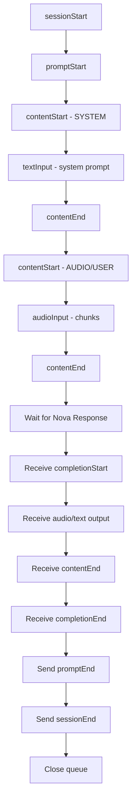

# Nova Speech Service

AWS Nova Speech implementation for text-to-speech generation using the Nova Sonic model.

## 🚨 CRITICAL: Event Sequence and Completion Handling 🚨

### ⚠️ promptEnd MUST BE SENT AFTER NOVA'S FINAL RESPONSE (completionEnd) ⚠️

**CORRECT EVENT SEQUENCE:**

1. Send all input events (sessionStart → promptStart → content blocks)
2. Wait for Nova's response (completionStart → content → completionEnd)
3. **ONLY AFTER receiving completionEnd**: Send promptEnd → sessionEnd

**WHY THIS MATTERS:**

- `promptEnd` signals the END of the entire conversation thread
- Sending it before Nova's response will prevent Nova from generating any output
- Nova will process input and send usage events, but won't generate content if `promptEnd` is sent too early

**CRITICAL FACTS:**

- ✅ `promptEnd` must be sent AFTER `completionEnd`
- ❌ NEVER send `promptEnd` after input events
- ❌ NEVER send `sessionEnd` before `completionEnd`
- 🛑 Nova is NOT waiting for `promptEnd` to start processing - it processes immediately after input

### Key Learnings (Updated 2025-09-03)

1. **Only `completionEnd` triggers stream closure** - `contentEnd` events are informational only
2. **Completion handler must be idempotent** - Use flags to prevent duplicate execution
3. **Handle timeout errors gracefully** - Nova may timeout with "Timed out waiting for input events"
4. **Send cleanup events properly** - `promptEnd` → `sessionEnd` → `queue.close()`
5. **promptEnd MUST be sent AFTER Nova's response** - Sending it too early prevents output generation

### Event Flow

```
1. Send input events (sessionStart → promptStart → content)
2. Wait for Nova response
3. Receive: completionStart → audioOutput → contentEnd → completionEnd
4. On completionEnd: Send promptEnd → sessionEnd → close queue
5. On timeout error: Trigger same completion handler
```

### Token Count Understanding

**Speech Tokens vs Text Tokens:**
- **Text Tokens**: ~4 chars/token, standard NLP tokenization
- **Speech Tokens**: ~150 tokens/second, time-based audio segmentation
- System prompt (364 chars) = 22 text tokens is normal
- Audio input (1s @ 16kHz) = ~150 speech tokens is expected

### Audio Format Requirements

**Input Audio (from Polly to Nova):**
- Format: Raw PCM (NOT WAV)
- Sample Rate: 16kHz
- Bit Depth: 16-bit signed little-endian
- Channels: Mono
- Encoding: Base64
- Chunking: 24KB chunks work well

## AWS Nova Speech Service

This service provides integration with AWS Nova Speech (Sonic) for text-to-speech and speech-to-speech capabilities.

## Important Implementation Notes

### Handling Nova Speech Completion Events

Nova Speech has been observed to be unreliable in sending `completionEnd` events. To ensure proper session closure and event handling, the implementation uses the following approach:

1. **ContentEnd with END_TURN**: When a `contentEnd` event is received with `stopReason: "END_TURN"`, the system automatically synthesizes a `completionEnd` event and triggers the completion handler.

2. **Timeout Handling**: When Nova times out waiting for input events (ValidationException), the system:
   - Creates a synthetic `contentEnd` event with `stopReason: "END_TURN"`
   - Processes it through the response processor
   - This automatically triggers the completion flow

This approach ensures reliable session closure regardless of whether Nova sends a `completionEnd` event or not.

### ⚠️ IMPORTANT: Nova Sonic Audio-Only Mode ⚠️

**Nova Sonic does NOT require or accept user text prompts when processing audio input.**

When using audio input:

- ✅ Send: sessionStart → promptStart → systemPrompt → audioInput → (wait for response)
- ❌ Do NOT send: user text events
- The audio itself IS the user input - no text transcription needed
- Nova will process the audio directly without requiring a text representation

## 🔧 Tool Use with Nova Speech

### Overview

Nova Speech supports tool use (function calling) for enhanced capabilities. Tools must be configured in the `promptStart` event and Nova will automatically request tools when needed.

### Tool Configuration

Tools are configured in the `promptStart` event:

```typescript
{
  event: {
    promptStart: {
      promptName: "chat_123",
      toolConfiguration: {
        tools: [{
          toolSpec: {
            name: "RAGtool",
            description: "Retrieves relevant information from a knowledge base",
            inputSchema: {
              json: '{"type":"object","properties":{"query":{"type":"string"}},"required":["query"]}'
            }
          }
        }],
        toolChoice: {
          tool: { name: "RAGtool" } // Optional: force tool use
        }
      }
    }
  }
}
```

### Tool Response Format

Nova expects tool results in a specific format according to AWS documentation:

```typescript
{
  event: {
    toolResult: {
      promptName: "chat_123",
      contentName: "unique-content-id",
      content: '[{"json": <your-tool-result>}]', // Stringified array with json property
      status: "success" // or "error"
    }
  }
}
```

### Implementation Pattern

1. **Configure tools in promptStart** - Define available tools
2. **Intercept Nova's tool requests** - Monitor output events for toolUse
3. **Send tool results** - Use Nova's toolUseId in response
4. **Continue conversation** - Nova processes results and continues

### Critical Implementation Details

1. **ID Matching**: The `toolUseId` from Nova's request MUST match in your response
2. **Event Timing**: Tool results should be sent with a small delay (500ms) to ensure Nova is ready
3. **Format Requirements**: Tool results must be wrapped in `[{"json": ...}]` format
4. **No Simulation**: Never simulate Nova's tool request events - only respond to actual requests

### Example Tool Flow

```typescript
// 1. Nova requests a tool
{
  event: {
    toolUse: {
      toolUseId: "abc-123",
      toolName: "RAGtool",
      input: { query: "auto loan interest rates" }
    }
  }
}

// 2. Your response
{
  event: {
    toolResult: {
      promptName: "chat_123",
      contentName: "def-456",
      content: '[{"json":[{"title":"Auto Loan","text":"1.99% - 5% rates"}]}]',
      status: "success"
    }
  }
}
```

### Common Tool Use Errors

1. **"Tool Response parsing error"** - Wrong format, ensure `[{"json": ...}]` structure
2. **"Not expecting a tool result"** - toolUseId doesn't match Nova's request
3. **"ValidationException"** - Event structure issues or timing problems

## Overview

This service provides a robust interface to AWS Nova Sonic for generating high-quality speech from text or audio inputs. It implements bidirectional streaming with AWS Bedrock Runtime, enabling real-time audio generation and delivery.

## Architecture

### Core Components

```
novaSpeech/
├── index.ts                 # Main service entry point
├── types.ts                 # TypeScript interfaces and types
├── stream/                  # Streaming components
│   ├── SessionManager.ts    # Session lifecycle management
│   ├── StreamHandler.ts     # Bidirectional stream orchestration
│   ├── EventBuilder.ts      # Event construction for Nova API
│   ├── EventQueue.ts        # Event ordering and delivery
│   ├── InputStreamHandler.ts # Sends events to Nova
│   ├── OutputStreamHandler.ts # Processes Nova responses
│   └── responseProcessor.ts # Response handling and Redis publishing
├── events/                  # Event definitions
│   ├── in/                  # Input events (sent to Nova)
│   └── out/                 # Output events (received from Nova)
└── tests/                   # Test files
```

### Key Classes

#### NovaSpeechService

Main service class that orchestrates the entire speech generation process.

```typescript
const service = new NovaSpeechService();
const result = await service.generateSpeechStream(config, metadata, context);
```

#### SessionManager

Manages session lifecycle with unique IDs for tracking.

```typescript
- createSession() - Creates new session with UUID
- getSession() - Retrieves active session
- endSession() - Properly closes session
```

#### EventBuilder

Constructs properly formatted events for Nova API.

```typescript
- sessionStart() - Initialize session with inference config
- promptStart() - Configure voice and output settings
- createTextContentEvents() - Build text content event sequence
- createAudioContentEvents() - Build audio content event sequence
- promptEnd() - Signal input completion
- sessionEnd() - Close session
```

#### ResponseProcessor

Handles Nova's responses and publishes audio to Redis.

```typescript
- processEvent() - Routes events to appropriate handlers
- handleAudioOutput() - Publishes audio chunks to Redis
- handleTextOutput() - Accumulates text responses
- getUsageStats() - Returns token usage statistics
- isCompletionReceived() - Check if completionEnd was received
```

## Event Flow

The service follows a strict event sequence for Nova API communication:



## Configuration

### NovaSpeechConfig Interface

```typescript
interface NovaSpeechConfig {
  modelId?: string; // Default: "amazon.nova-sonic-v1:0"
  systemPrompt?: string; // System instructions
  prompt?: string; // User text input
  audioInput?: string; // Base64 encoded audio input
  voice?: string; // Voice selection (default: "tiffany")
  temperature?: number; // Generation temperature (0-1)
  maxTokens?: number; // Maximum tokens to generate
  topP?: number; // Top-p sampling parameter
  redisChannel?: string; // Redis channel for audio publishing
  interactive?: boolean; // Interactive mode flag
}
```

### Available Voices

- `tiffany` - Default female voice
- `matthew` - Male voice
- `amy` - Female voice
- `ambre` - Female voice (French accent)
- `florian` - Male voice (German accent)
- `beatrice` - Female voice (Italian accent)
- `lorenzo` - Male voice (Italian accent)
- `greta` - Female voice (Swedish accent)
- `lennart` - Male voice (Swedish accent)
- `lupe` - Female voice (Spanish accent)
- `carlos` - Male voice (Spanish accent)

## Usage Example

```typescript
import { NovaSpeechService } from "./services/aws/novaSpeech";
import { getNodeCredentials } from "./credentials";

const service = new NovaSpeechService();

const config: NovaSpeechConfig = {
  systemPrompt: "You are a helpful assistant.",
  prompt: "Hello, how can I help you today?",
  voice: "tiffany",
  temperature: 0.7,
  maxTokens: 2000,
  redisChannel: "audio-stream-channel",
};

const metadata = {
  workflowId: "workflow-123",
  executionId: "exec-456",
  chatId: "chat-789",
  conversationId: "conv-abc",
  userId: "user-xyz",
};

const context = {
  // credential context
};

try {
  const result = await service.generateSpeechStream(config, metadata, context);
  console.log("Generated audio with", result.chunk_count, "chunks");
  console.log("Text output:", result.textOutput);
} catch (error) {
  console.error("Speech generation failed:", error);
}
```

## Audio Streaming

The service streams audio output in real-time:

1. Audio is generated in chunks by Nova
2. Each chunk is Base64 encoded MP3 data
3. Chunks are published to Redis with metadata
4. Clients can subscribe to Redis channel for real-time playback

### Redis Audio Event Structure

```typescript
{
  audioData: string; // Base64 encoded MP3 chunk
  format: "mp3";
  textReference: string; // Associated text
  sourceType: "NovaSpeech";
  chatId: string;
  conversationId: string;
  userId: string;
  providerId: string;
  workflowId: string;
  workflowRunId: string;
  redisChannel: string;
  index: number; // Chunk sequence number
}
```

## Error Handling

The service implements comprehensive error handling:

- **ValidationException** - Invalid event order or missing fields
- **ModelStreamErrorException** - Nova model streaming errors
- **InternalServerException** - AWS service errors
- **Timeout Protection** - 30-second response timeout

## Important Implementation Notes

### Session Lifecycle Management

**Completion Handling:**

1. **Only `completionEnd` triggers cleanup** - `contentEnd` is informational only
2. **Idempotent completion handler** - Use flags to prevent duplicate execution
3. **Error handling for timeouts** - ValidationException with "Timed out waiting for input events" triggers same cleanup
4. **Proper cleanup sequence**: promptEnd → sessionEnd → queue.close()

### Event Ordering

- System prompt MUST be the first content block
- Audio input should follow text content blocks
- All content blocks MUST be properly closed with `contentEnd`
- Small delays (50ms) between audio chunks prevent overwhelming Nova
- **CRITICAL**: promptEnd/sessionEnd must come AFTER Nova's completionEnd, not after input

### Event Structure Requirements

1. **Event Wrapper Required**: All events MUST be wrapped with `event` property
   - ✅ Correct: `{ event: { sessionStart: {...} } }`
   - ❌ Wrong: `{ sessionStart: {...} }`

2. **Streaming Format**: SDK expects AsyncIterable with `{ chunk: { bytes: Uint8Array } }` format

### Known Issues and Solutions

1. **"Timed out waiting for input events"**
   - Cause: Nova didn't receive promptEnd/sessionEnd properly
   - Solution: Error handler triggers completion callback on timeout

2. **No output generation**
   - Cause: Sending promptEnd too early (before Nova's response)
   - Solution: Only send promptEnd after receiving completionEnd

### Audio Format

- Input: 16kHz, 16-bit, mono PCM (when using audio input)
- Output: MP3 format in Base64 encoding

### Performance Considerations

- Uses HTTP/2 for efficient streaming
- Audio chunks are split into 4KB pieces
- Implements connection pooling with max 10 concurrent streams
- 5-minute request/session timeout

## Debugging

Enable detailed logging:

```typescript
import { logger } from "./logger";
logger.level = "debug";
```

Key log points:

- Event creation and sending
- Response event processing
- Audio chunk publishing
- Session state changes
- Error conditions

## Dependencies

- `@aws-sdk/client-bedrock-runtime` - AWS Bedrock client
- `@smithy/node-http-handler` - HTTP/2 handler
- `pino` - Logging
- Redis client (for audio publishing)

## Future Improvements

1. Add support for streaming text input
2. Implement conversation history in prompts
3. Add voice cloning capabilities
4. Support for multiple languages
5. Implement caching for repeated requests
6. Add metrics and monitoring
7. Support for SSML (Speech Synthesis Markup Language)

## Related Documentation

- [AWS Nova Documentation](https://docs.aws.amazon.com/nova/latest/userguide/)
- [Nova Input Events](https://docs.aws.amazon.com/nova/latest/userguide/input-events.html)
- [Nova Output Events](https://docs.aws.amazon.com/nova/latest/userguide/output-events.html)
